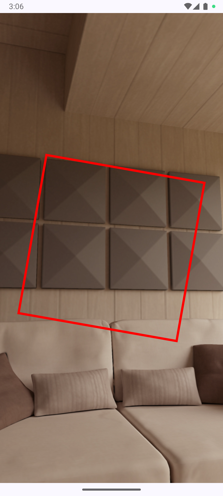
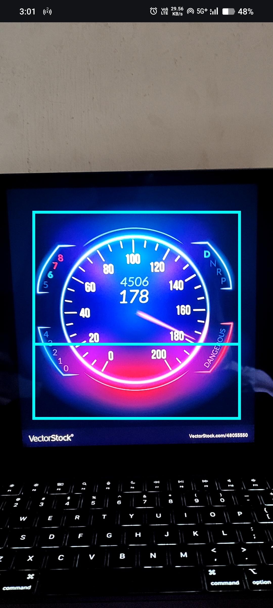
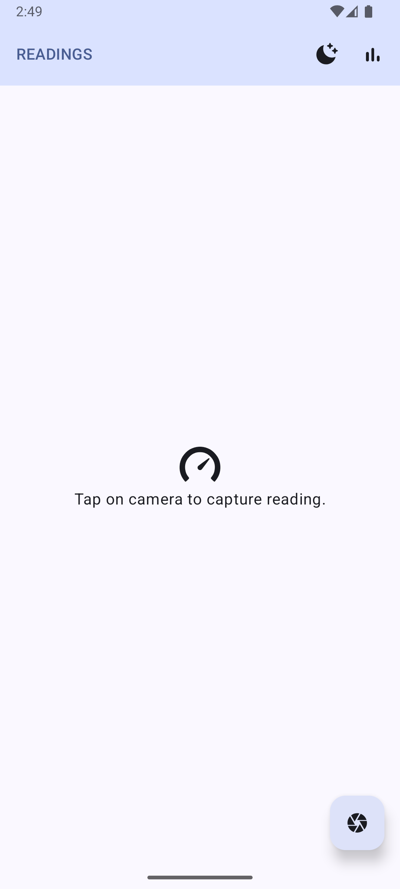
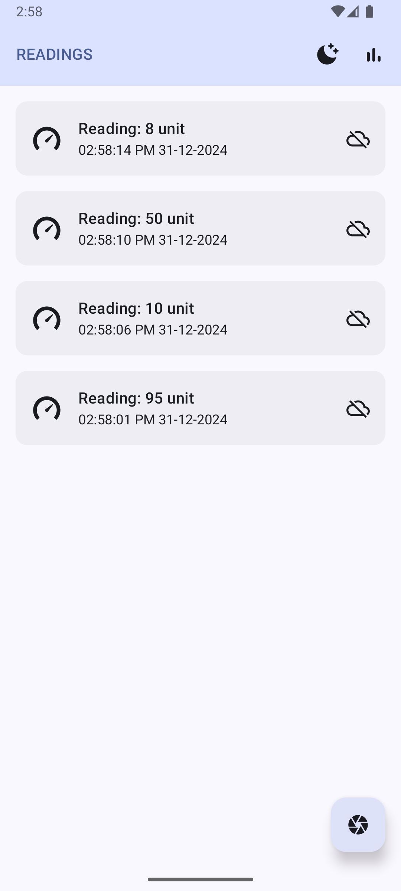
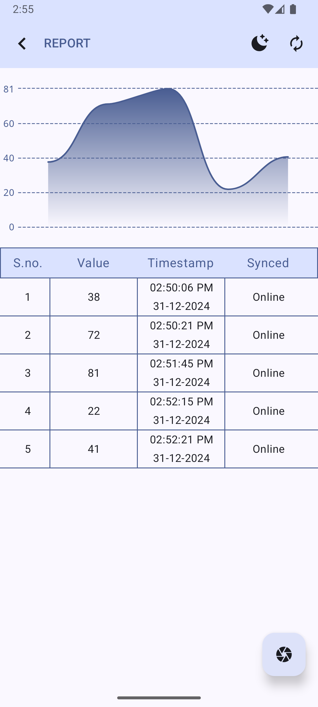
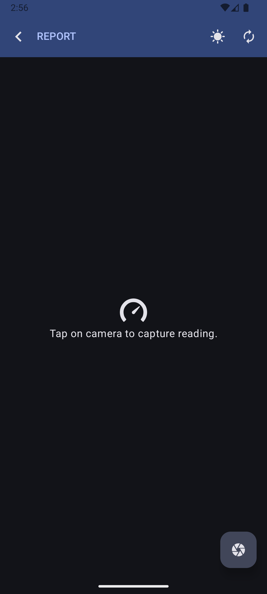
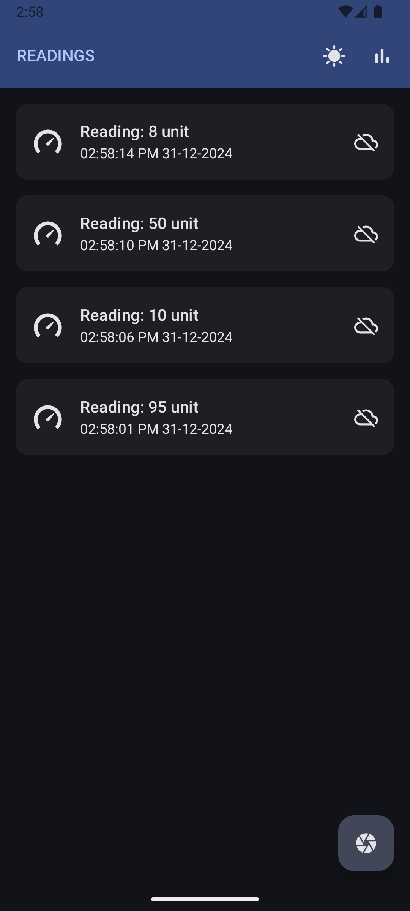
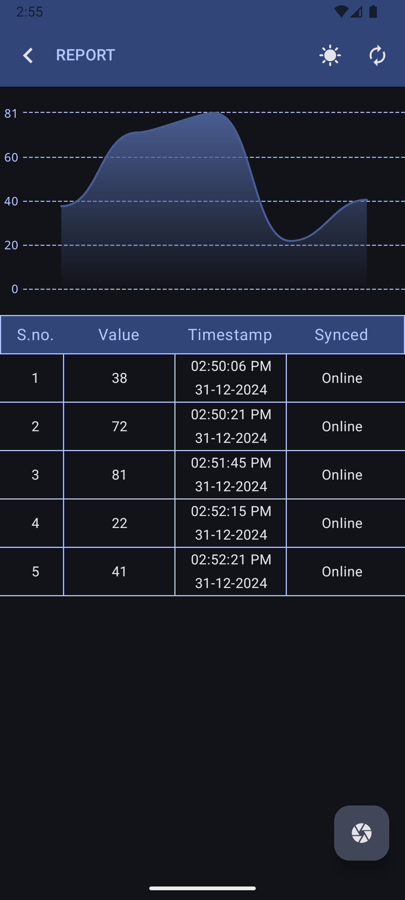

## GaugeRight app

This is a prototype Android application for scanning gauges/meters and capturing their readings using the CameraX API. The captured readings are stored locally in a Room database and can be synced to a server on-demand using a sync action.

### Project Setup
Clone this repo and open in Android Studio.

Current Gradle version:  
8.9 with AGP 8.7.3

Current JDK version:  
Gradle JDK 21 (Open Android Studio settings > Build, Execution, Deployment > Build Tools > Gradle > select Gradle JDK)

### Tech Stack

-   **Language**: Kotlin
-   **UI**: Jetpack Compose with Material3
-   **Architecture**: MVVM
-   **Dependency Injection**: Dagger-Hilt
-   **Asynchronous Operations**: Kotlin Coroutines
-   **Background Tasks**: WorkManager
-   **Network**: Retrofit
-   **Database**: Room
-   **Hardware**: Camera (CameraX API)

### Features

-   **Simulated Gauge Reader**: Capture gauge readings using CameraX.
-   **Reading Listing**: View captured readings from the local database.
-   **Report Screen**: Visualize data using a line chart.
-   **Dark Mode**: Built-in support for dark mode.
-   **Sync Now**: Trigger server synchronization manually.

### Challenges

#### 1. Managing Data Flow

-   **Issue**: Multiple types flows streaming data to single state object for ui layer.
-   **Solution**: Collected data from one flow and emitted in another.

#### 2. Handling Work Requests to sync data

-   **Issue**: Managing concurrent WorkManager requests and identifying them.
-   **Solution**: After investigating the work manager behavior using debugger. Added tags and replace existing policy to distinguish work requests.

### Improvements

There’s always room for improvement in terms of design and architecture. Future enhancements could include:

-   Optimizing data pipelines: Combine flows to streamline data streaming between MVVM layers.
-   Improved user interface and user experience design.

### Screenshots

    
    

    
    
    

    
    
    

